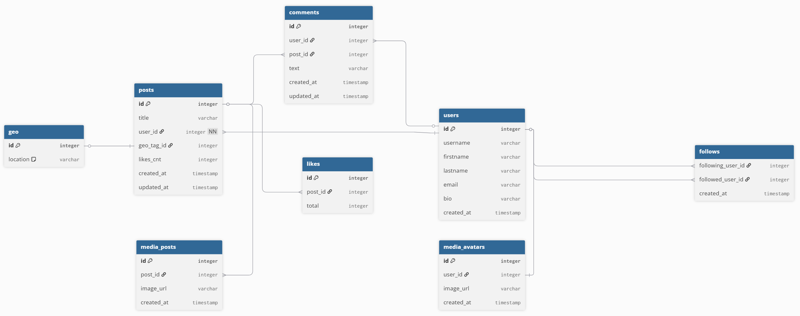

### [Интерактивный просмотр схемы базы данных](https://dbdiagram.io/d/Social-Network-68d6ae16d2b621e422171c3c)

### Прогноз количества дисков для хранения и обработки представленных данных на 1 год:

- [Расчеты RPS/Трафика](https://github.com/zkryaev/social_network_system_design/tree/develop)

#### Расчет характеристик по доменам
| Домен         | Объем хранимого    | Throughput | IOPS    |
|---------------|--------------------|------------|---------|
| Посты         | 3,2 Tb             | 70 Mb/s    | ~3600   |
| Комментарии   | 16 Tb              | 13 Mb/s    | ~1700   |
| Лайки         | 2,2 Tb             | 98 Kb/s    | ~5300   |
| Подписка      | 22 Gb              | 61 Kb/s    | ~600    |
| Профиль       | 31 Mb              | 12 Mb/s    | ~600    |
| Поиск         | —                  | 139 Kb/s   | ~600    |
| Медиа         | 24 Pb (~24 000 Tb) | 53 Gb/s    | ~3600   |

#### Расчет числа HDD по доменам
| Домен         | Объем хранимого | Throughput | IOPS |
|---------------|-----------------|------------|------|
| Посты         | 1               | 1          | 36   |
| Комментарии   | 1               | 1          | 17   |
| Лайки         | 1               | 1          | 53   |
| Подписка      | 1               | 1          | 6    |
| Профиль       | 1               | 1          | 6    |
| Поиск         | —               | 1          | 6    |
| Медиа         | 750             | 530        | 36   |

- Чтобы хранить и обрабатывать в том числе изображения нужно 750 дисков типа HDD
- Если опираться, что средняя цена 6ТБ HDD = 100$, то 750\*(32/6)\*100$ ~ 400k$  

#### Расчет числа SSD по доменам
| Домен         | Объем хранимого | Throughput | IOPS |
|---------------|-----------------|------------|------|
| Посты         | 1               | 1          | 4    |
| Комментарии   | 1               | 1          | 2    |
| Лайки         | 1               | 1          | 6    |
| Подписка      | 1               | 1          | 1    |
| Профиль       | 1               | 1          | 1    |
| Поиск         | —               | 1          | 1    |
| Медиа         | 240             | 106        | 4    |

- Чтобы хранить и обрабатывать в том числе изображения нужно 240 дисков типа SSD
- Если опираться, что средняя цена 6ТБ SSD = 200$, то 240\*(100/6)\*200$ ~ 800k$

#### Расчет числа nVME по доменам
| Домен         | Объем хранимого | Throughput | IOPS |
|---------------|-----------------|------------|------|
| Посты         | 1               | 1          | 1    |
| Комментарии   | 1               | 1          | 1    |
| Лайки         | 1               | 1          | 1    |
| Подписка      | 1               | 1          | 1    |
| Профиль       | 1               | 1          | 1    |
| Поиск         | —               | 1          | 1    |
| Медиа         | 800             | 18         | 1    |

- Чтобы хранить и обрабатывать в том числе изображения нужно 800 дисков типа nVME
- Если опираться, что средняя цена 6ТБ nVME = 500$, то 800\*(30/6)\*500$ ~ 2kk$ 

Вывод:
- В рамках расчетов я бы взял 1 SSD для всех доменов кроме Медиа - его бы хватило на несколько лет.
  
  Медиа держал бы на 750 HDD (какой нибудь Blob Storage развернуть на RAID массивах)

  Таким образом быстро бы грузили ленту, обновляли данные, но с изображениями пришлось бы подождать

- Кроме того, можно подумать о сжатии, правда почти всегда это потери в качестве изображения.